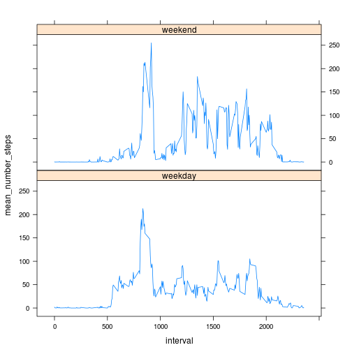

# Reproducible Research: Peer Assessment 1

## Loading and preprocessing the data


```r
# loadl library
library(lattice)

# unzip data
unzip("activity.zip")

# read data
data <- read.csv("activity.csv")

# replace NA values with 0 Note: we'll need original data later
datafiltered <- na.omit(data)
```


## What is mean total number of steps taken per day?

We'll make a histogram of the total number of steps taken each day:


```r

# sum number of steps, grouping by days
stepsbyday <- aggregate(datafiltered$steps, by = list(datafiltered$date), sum)

# change names of columns in dataframe
names(stepsbyday) <- c("day", "number_of_steps")

hist(stepsbyday$number_of_steps, xlab = "Number of steps taken each day", main = "Number of steps taken each day")
```

 


The mean and median total number of steps taken per day are:


```r
cat("Mean number of steps per day: ", mean(stepsbyday$number_of_steps))
```

```
## Mean number of steps per day:  10766
```

```r
cat("Median number of steps per day: ", median(stepsbyday$number_of_steps))
```

```
## Median number of steps per day:  10765
```


## What is the average daily activity pattern?

To gain insight into this question, we'll make a time series plot (i.e. type = "l") of the 5-minute interval (x-axis)
and the average number of steps taken, averaged across all days (y-axis):


```r
# calculate mean number of steps by interval
stepsinterval <- aggregate(datafiltered$steps, by = list(datafiltered$interval), 
    mean)

# change names of columns in dataframe
names(stepsinterval) <- c("interval", "number_of_steps")

# plot number of steps by interval
plot(stepsinterval$interval, stepsinterval$number_of_steps, type = "l", xlab = "Interval", 
    ylab = "Number of steps")
```

 

## Which 5-minute interval, on average across all the days in the dataset, contains the maximum number of steps?


```r
maxinterval <- stepsinterval[max(stepsinterval$number_of_steps) == stepsinterval$number_of_steps, 
    1]
cat("Interval with maximun number of steps: ", maxinterval)
```

```
## Interval with maximun number of steps:  835
```


## Imputing missing values

Calculate and report the total number of missing values in the dataset:


```r
cat("Total number of missing values: ", colSums(is.na(data))[1])
```

```
## Total number of missing values:  2304
```


Devise a strategy for filling in all of the missing values in the dataset:

- Our strategy: We'll create a new dataset named "dataf", <b> replacing missing values with mean values for each interval</b> :


```r
# merge with data frame containing mean number of steps
dataf <- merge(data, stepsinterval)
# replace NAs with median number of steps per interval
dataf$steps[is.na(dataf$steps)] <- dataf$number_of_steps[is.na(dataf$steps)]
```


Then, we make a histogram of the total number of steps taken each day, using "dataf" dataframe:


```r
# sum number of steps, grouping by days
newstepsbyday <- aggregate(dataf$steps, by = list(dataf$date), sum)

# change names of columns in dataframe
names(newstepsbyday) <- c("day", "number_of_steps")

# plot histogram
hist(newstepsbyday$number_of_steps, xlab = "Number of steps taken each day", 
    main = "Number of steps taken each day after missing values were imputed")
```

 


And finally we calculate mean and median:


```r
cat("Mean number of steps per day: ", mean(newstepsbyday$number_of_steps))
```

```
## Mean number of steps per day:  10766
```

```r
cat("Median number of steps per day: ", median(newstepsbyday$number_of_steps))
```

```
## Median number of steps per day:  10766
```


The results match original (non-corrected) data.

Imputing missing data doesn't change overall conclussions.

## Are there differences in activity patterns between weekdays and weekends?

This plot will help us to respond the question:


```r
# convert to date
dataf$date <- as.Date(dataf$date)

# add new column: weekend or weekday?
dataf$day <- rep("weekday", nrow(dataf))
dataf$day[as.POSIXlt(dataf$date)$wday %in% c(6, 7)] <- "weekend"

# sum steps by interval and day of week
dataf <- aggregate(dataf$steps, by = list(dataf$interval, dataf$day), mean)
names(dataf) <- c("interval", "day", "mean_number_steps")

# plot graph
xyplot(mean_number_steps ~ interval | day, data = dataf, layout = c(1, 2), type = "l")
```

 


Weekdays and weekend days show different patterns.


